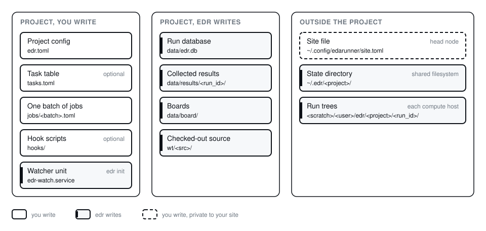

# Configure a project

After this page your own flow is a project. It has an `edr.toml` with
stages and metrics, a site file with your hosts, and a batch that `edr
check` accepts.



## 1. Create the project

```sh
mkdir myflow && cd myflow
edr init --site ~/.config/edarunner
```

`edr init` writes `edr.toml`, a template with one stage and one metric,
and `edr-watch.service`, the systemd unit for the watcher. `--site` names
the directory or the file of the private site file; `edr init` does not
write that file. The template then points at
`~/.config/edarunner/site.toml`.

Put `data/` in the project's `.gitignore`. In git: `edr.toml`,
`tasks.toml`, `jobs/`, `hooks/` and `edr-watch.service`. Not in git: the
database, the results and the boards under `data/`, the state directory,
the worktrees, the run trees on the hosts, `site.toml` and the Telegram
token.

## 2. Write the site file

The site file holds the hosts, the tools and the bot. It stays outside
the project and outside git, because it names your machines.

```toml
schema = 1
scratch = ["/scratch"]

[hosts.hostA]
cores = 64
ram_gb = 256

[hosts.hostB]
cores = 128
ram_gb = 512
```

Add `[tools.<name>]` when not every host has a tool, or when a stage has
to wait for seats, and `[telegram]` when you want alerts on your phone.
`examples/site/` shows both with placeholder names. The core knows no
licence manager; a site hook such as `examples/site/hooks/flexlm_free.sh`
turns the output of a licence tool into the `free total` line a probe
prints. [reference/configuration.md](reference/configuration.md) lists
every key.

## 3. Declare the flow

Edit `edr.toml`: the repository under `[source]`, one `[stages.<name>]`
per command of the flow, and the `[metrics.<name>]` you want in the
database. Stages run in file order.


Cut a stage where the tool session ends, or where you want a budget, a
retry rule or a stop of your own. Everything inside a stage is a step,
which `edr` tracks through `progress`, extracts metrics from per step,
and resumes through `{checkpoint}`. A stage with `foreach = "tasks"`
fans out into tasks that run in parallel on the host and share one queue
across runs. The two configs below show the two shapes a flow takes. The
names and paths are examples.

### One tool session, many steps inside

A commercial place-and-route flow runs its stages inside one tool
session. A new session per stage would cost a licence checkout and a
library reload. So the stages stay inside one command, and `edr` tracks
them as steps through the numbered report directories.

```toml
[env]
PATH = "{root}/.venv/bin:$PATH"          # the flow calls `python` from the venv of its tree

[stages.pnr]
cmd = "make -C flow pnr RUN={tree_id} CONFIG={config} MAX_CORES={cores} {overrides}"
resume = "make -C flow pnr RUN={tree_id} CONFIG={config} MAX_CORES={cores} FIRST_STAGE={checkpoint} {overrides}"
steps = ["setup", "analyze", "elaborate", "constraints", "synth-map", "floorplan", "pg",
         "synth-logic-opto", "synth-init-opto", "synth-final-opto", "cts", "route", "route-opt"]
progress = "ls flow/runs/{tree_id}/reports 2>/dev/null | grep -cE '^[0-9]+$'"
needs = { cores = 16, disk_gb = 70, tools = ["pnr"] }
budget = { hours = 14, disk_gb = 150 }
retry = { match = "licen[cs]e", wait_s = 900, max = 3 }
collect = ["flow/runs/{tree_id}/reports/"]
collect_on_request = { netlist = ["flow/runs/{tree_id}/out/{vars.netlist_stage}/"] }
prune = { lib = ["flow/runs/{tree_id}/out/library"] }

[stages.power]
foreach = "tasks"
parallel = 1
task_dir = "sim/tests/{build_tag}/{task.test}"
cmd = "env RUN_DIR={root}/flow/runs/{tree_id} NETLIST={root}/flow/runs/{tree_id}/out/{vars.netlist_stage}/top.v flow/power/run.sh {task.kernel} CONFIG={config} {task.args}"
after_each = "rm -f {task_dir}/wave.vcd"
needs = { cores = 4, disk_gb = 60, tools = { sim = 1 } }
budget = { hours = 8, disk_gb = 400, per = "task" }
collect = ["{task_dir}/power/"]

[metrics.area_cell_um2]
stage = ["pnr"]
step = "*"
file = "flow/runs/{tree_id}/reports/{step}/area_hier.rpt"
regex = '^i_top\s+(\S+)'
unit = "um2"
canonical = "design__instance__area"

[metrics.power_w]
stage = "power"
file = "{task_dir}/power/reports/power.csv"
csv = { where = { phase = "WHOLE", depth = "0" }, column = "total_w" }
unit = "W"
canonical = "power__total"

[metrics.window_fs]
stage = "power"
file = "{task_dir}/power/phases.json"
json = "window_dur"
unit = "fs"

[metrics.energy_nj]
stage = "power"
file = "{task_dir}/power/phases.json"
python = "hooks/energy.py:energy_nj"   # reads power.csv next to it; returns power_w * window_fs / 1e6
unit = "nJ"
canonical = "energy"
```

The stages run in file order, `pnr` then `power`. A job that lists
`stages = ["power"]` with `reuse` runs the kernels on an existing
netlist. The job sets `vars = { netlist_stage = 11 }` to name the step
directory that holds it. `{vars.netlist_stage}` has no value without it.

Three details matter in this shape:

- `{tree_id}` names the tree the flow writes in. A run that reuses a tree
  has its own `{run_id}`, but the flow's run directory must keep the
  tree's id.
- The flow needs its own `PATH`. The project `[env]` table carries it, and
  `$PATH` expands on the host.
- A number the flow does not print comes from a `python` hook that reads
  the files the flow does print, such as the energy from a power and a
  window. [results.md](results.md) shows the hook.

### One command per step

An open flow with a script per step and a checkpoint between steps maps
one stage to one step. Here the flow runs inside a tool container, and
the container version is part of the command, because the flow scripts
match the tool version they were written for.

```toml
[env]
PATH = "/opt/eda/bin:$PATH"

[stages.synth]
cwd = "yosys"
cmd = "oseda -2026.04 ./run_synthesis.sh --synth"
needs = { cores = 8, disk_gb = 5 }
budget = { hours = 2 }
collect = ["yosys/reports/", "yosys/croc.log"]

[stages.floorplan]
cwd = "openroad"
cmd = "oseda -2026.04 ./run_backend.sh --floorplan"
budget = { hours = 1 }
collect = ["openroad/reports/"]

[stages.place]
cwd = "openroad"
cmd = "oseda -2026.04 ./run_backend.sh --placement"
budget = { hours = 3 }
collect = ["openroad/reports/"]

[metrics.area_synth_um2]
stage = "synth"
file = "yosys/reports/croc_area.rpt"
regex = "Chip area for module '\\\\croc_chip':\\s+([0-9.]+)"
unit = "um2"
canonical = "design__instance__area"

[metrics.wns_place_ns]
stage = "place"
file = "openroad/reports/02_croc.placement.rpt"
regex = 'wns max\s+(-?[0-9.]+)'
unit = "ns"
canonical = "timing__setup__ws"
```

The source of this flow keeps its PDK in a directory that git ignores, so
`edr checkout --dirty <tree>` snapshots the working tree instead of adding a
worktree. The run id then carries `-dirty-<hash of the diff>`.

`examples/openroad-gcd/` runs this shape on an open flow in CI: the GCD design
of OpenROAD-flow-scripts on nangate45, three stages `synth`, `floorplan` and
`place`, one `make` target each. The area comes from `synth_stat.txt`, the
area and the slack of each later stage from the METRICS2.1 JSON of ORFS.

## 4. Write a batch

```toml
# jobs/sweep1.toml
batch = "sweep1"
source = "3f9a2c1"

[[job]]
label = "base"
config = "base"

[[job]]
label = "base_dw0"
config = "base"
overrides = { DW = 0 }
vars = { netlist_stage = 11 }
```

`source` is the tag that `edr checkout` printed; [run.md](run.md) shows
the checkout. A job is one run: a label, an optional configuration name
the flow understands, optional overrides that become `KEY=VALUE` tokens in
the command, and optional `stages` and `tasks` lists. The run id is
`<date>_<label>_<build_tag>_g<src>`. A job without `config` and overrides
has an empty build tag, and the run id drops that part with its `_`.

The `vars` table holds any other value the flow needs. Each key is a
placeholder `{vars.<name>}` in the stage strings, `[env]` and `collect`. A
key must be an identifier. `overrides` reach the command as tokens, while
`vars` go only where a string names them.

## 5. Check

```sh
edr check
```

`check` loads every file, imports the hooks, and probes every host over
ssh for its cores, load, RAM and scratch. It names every tool the head
node lacks, and plans every batch under `jobs/`. It prints one `problem:`
line per fault and exits 1, or `ok: 2 hosts, 3 stages, 5 metrics, 1
batches` and exits 0.

## A scheduler

A lab with HTCondor, Slurm or LSF lets the scheduler pick the host. The
driver is then the job itself: the scheduler starts it, and the driver
writes the same heartbeat as on an ssh host. The site file names the
backend in `[scheduler]`:

```toml
schema = 1
scratch = []

[scheduler]
backend = "slurm"                   # "condor", "slurm" or "lsf"
submit_via = ["ssh", "submithost"]  # empty: the head node submits itself
tree_root = "/net/share/{user}"     # a filesystem every node mounts
max_jobs = 20                       # runs of the project in the scheduler at once
queue = "long"                      # the Slurm partition or the LSF queue
options = ["--account=chip"]        # raw submit lines or arguments

[tools.fc]
seats = 10
probe = ["{site_dir}/hooks/flexlm_free.sh", "fc"]
licence = "fc"                      # the licence name in the scheduler
```

| Backend | Submits | Asks each cycle | Stops | Handle |
|---|---|---|---|---|
| `condor` | `condor_submit -terse <run_id>.sub` | `condor_q <ids> -af ClusterId ProcId JobStatus HoldReason` | `condor_rm` | `condor:<cluster>.<proc>` |
| `slurm` | `sbatch --parsable <run_id>.sbatch` | `squeue -h -o "%i %T %r" -j <ids>`, then `sacct` for the jobs that left the queue | `scancel` | `slurm:<jobid>` |
| `lsf` | `bsub ...` | `bjobs -noheader -o "jobid stat" <ids>` | `bkill` | `lsf:<jobid>` |

The submit file and the script lie next to the spec in the state
directory, so `submit_via` must reach a host that reads the state
directory at the same path. Every scheduler command runs through
`submit_via`, and one command per cycle asks for every run at once.

`plan` probes no host under a scheduler. The run tree goes to
`<tree_root>/<run_prefix>/<run_id>`, and `launch` copies the source there
from the head node. A job with `host = "auto"` goes wherever the
scheduler puts it; a named host becomes a requirement of the job. The
host of a run is the name the driver writes into its first heartbeat.
Above `max_jobs` a job is `queued`, and the watcher submits it when a
run of the project ends.

The job asks for the most cores, `needs.ram_gb` and `needs.disk_gb` of
its stages, the sum of the stage budgets as a wall time when every stage
has one, and one scheduler licence per tool with `licence`:

| Request | HTCondor | Slurm | LSF |
|---|---|---|---|
| cores | `request_cpus = N` | `--cpus-per-task=N --nodes=1` | `-n N -R "span[hosts=1]"` |
| `needs.ram_gb` | `request_memory` in MB | `--mem` in MB | `-R "rusage[mem=NGB]" -M NGB` |
| `needs.disk_gb` | `request_disk` in KB | `--tmp` in MB | `-R "rusage[tmp=NGB]"` |
| wall time | `periodic_remove` after the seconds | `--time=H:MM:00` | `-W H:MM` |
| licence | `concurrency_limits = fc:1` | `--licenses=fc:1` | `-R "rusage[fc=1]"` |
| a named host | `requirements = (Machine == "h")` | `--nodelist=h` | `-m h` |
| no restart | `periodic_hold = NumJobStarts > 1` | `--no-requeue` | `-rn` |
| `options` | lines before `queue` | `#SBATCH` lines | arguments before the driver |

The licence is a second gate. The scheduler counts it for the whole job,
from the start of the job to its end. The probe of the tool still runs
before each stage, because the licence server also serves users outside
the scheduler. `edr check` asks HTCondor (`condor_config_val -negotiator
FC_LIMIT`) or Slurm (`scontrol show lic fc`) whether the licence exists,
because a name the scheduler does not know never holds a job back. It
says so in a warning when it cannot ask, and always for LSF.

What stays in the site file under a scheduler: the `[tools]` names,
seats and probes, `env`, and the bot. `[hosts]` is optional and serves
only `edr hosts`, `retire` and `collect` over ssh. `scratch`,
`tool_procs` and `[placement]` in `edr.toml` have no effect. The
watcher looks for orphans only on ssh hosts; a scheduler ends the
processes of its own jobs.

## Next

[run.md](run.md) checks out the source, launches the batch and runs the
watcher behind it.
