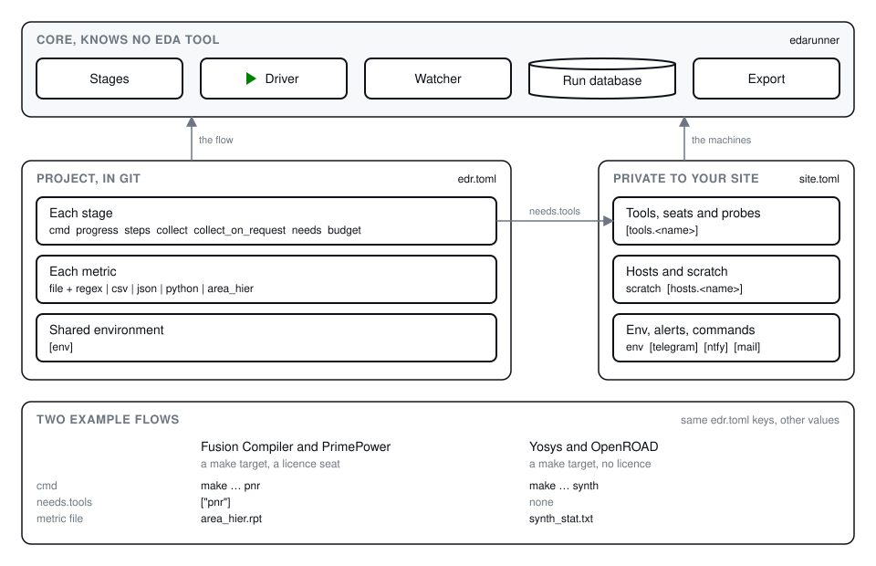

# Describe your machines

The site file tells edarunner which machines it may use and what they
have. This page sets one up with your hosts, your tools and their
licence seats, or with a scheduler, and lists what each host needs.



## The site file

The site file, `~/.config/edarunner/site.toml`, lives on the head node.
`site` in `edr.toml` names it. It describes the machines, not a project,
so one site file serves every project and every user of the same
machines. It names your hosts, your licence servers and your chat, so it
stays out of any public repository.

Because it is shared, keep it in a repository that the lab owns. Each
user clones that repository to `~/.config/edarunner/`, and a change to a
host or a tool reaches everyone with a `git pull`:

```sh
git clone <the lab's site repository> ~/.config/edarunner
```

A single user may start with a plain file at that path and move it into
a repository when a second person joins. The
[edarunner-example](https://github.com/lionnus/edarunner-example)
repository has a `site/` directory in the shape of such a repository,
which a lab copies once. Keep secrets such as a bot token out of the
repository by listing their files in its `.gitignore`.

```toml
schema = 1
scratch = ["/scratch"]
env = { PATH = "/opt/eda/bin:$PATH" }
tool_procs = "^(fc_shell|vsim|vlog)$"

[hosts.hostA]
cores = 64
ram_gb = 256
tools = { fc = "2024.09", questa = "2024.1" }

[hosts.hostB]
cores = 128
ram_gb = 512
tools = ["questa"]
```

`scratch` lists the scratch roots in order, and a run tree goes under the
largest writable one, as `<scratch>/<user>/edr/<project>/<run_id>/`.
`env` reaches every command on every host; [project.md](project.md#the-environment)
says how it combines with the project's own `[env]`. `tool_procs` is a
regular expression over process names, which the orphan check and
`edr hosts` use to find your tool processes. The host `local` is the
head node itself, reached without ssh.

`examples/site/` is a complete site file with placeholder names.
[reference/configuration.md](../reference/configuration.md#sitetoml)
lists every key, and the alert channels are in [alerts.md](alerts.md).

## Tools and licence seats

A `[tools.<name>]` table declares a tool. A host without `tools` has
every tool; a list or a table on the host says which ones it has, and a
version in the table reaches a stage as `{tool.<name>.version}`. A stage
names the tools it needs in `needs.tools`, and placement sends its job
only to a host that has them.

A tool with a `probe` also has a gate. The probe is an argv list that
prints the free seats, as `free` or `free total`, and the driver runs it
on the host before the stage starts and waits while too few seats are
free. [how-it-works.md](../how-it-works.md#stages-and-steps) explains
the wait and the seat leases that keep two drivers from taking the same
seat.

```toml
[tools.fc]
seats = 10
probe = ["bash", "{site_dir}/hooks/flexlm_free.sh", "27000@licence.example.com", "FEATURE-NAME"]
```

edarunner knows no licence manager itself. A site hook turns the output
of your licence tool into that one line;
`examples/site/hooks/flexlm_free.sh` does it for FlexLM. The hook must
exist at the same path on every host, so keep it on a shared filesystem.
`edr tools` runs every probe and shows the free seats.

## What a host needs

Nothing is installed on a host. The driver is a single file that
`edr launch` copies into the state directory, and the host runs it with
its own `python3`. Every host in `[hosts]` needs:

- Linux with `/proc`. The probe reads `/proc/loadavg` and
  `/proc/meminfo`, and the orphan check reads `/proc/<pid>/cwd` and
  `/proc/<pid>/environ`.
- A POSIX `sh`. Every remote command runs under `sh -c`, so the login
  shell can be `tcsh` or `csh`.
- GNU coreutils: `nproc`, `df -Pk`, `stat -c %s`, `readlink`, `nohup`, `tr`,
  and GNU `grep` and `find`.
- procps-ng 3.3.10 or newer, for `ps -o etimes,pcpu,cputimes` and
  `ps -o pgid`.
- util-linux `setsid`, because the driver starts in its own session.
- `python3` 3.6 or newer on the login `PATH`. The driver uses the
  standard library only.
- `rsync`, to copy the source tree over and the results back, and `awk`.
- `nvidia-smi` on `PATH` when the host has GPUs to report; without it
  the probe reports none.
- The state directory of every project, mounted at the same path as on
  the head node.

The head node reaches each host with `ssh` under `BatchMode=yes`, so the
keys must work with no password prompt and no host key prompt.
`edr check` names every host that does not answer its probe; run it
after you add or change a host. `edr hosts` then shows the load and the
free cores, RAM, scratch and GPUs of each host, and `[marks]` sets the
thresholds of its colour marks.

## A scheduler

A lab with HTCondor, Slurm or LSF lets the scheduler pick the host. The
driver is then the scheduler's job: the scheduler starts it, and it
writes the same heartbeat as on an ssh host. The site file names the
backend in `[scheduler]`:

```toml
schema = 1
scratch = []

[scheduler]
backend = "slurm"                   # "condor", "slurm" or "lsf"
submit_via = ["ssh", "submithost"]  # empty: the head node submits itself
tree_root = "/net/share/{user}"     # a filesystem every node mounts
max_jobs = 20                       # runs of the project in the scheduler at once
queue = "long"                      # the Slurm partition or the LSF queue
options = ["--account=chip"]        # raw submit lines or arguments

[tools.fc]
seats = 10
probe = ["bash", "{site_dir}/hooks/flexlm_free.sh", "27000@licence.example.com", "FEATURE-NAME"]
licence = "fc"                      # the licence name in the scheduler
```

| Backend | Submits | Asks each cycle | Stops | Handle |
|---|---|---|---|---|
| `condor` | `condor_submit -terse <run_id>.sub` | `condor_q <ids> -af ClusterId ProcId JobStatus HoldReason` | `condor_rm` | `condor:<cluster>.<proc>` |
| `slurm` | `sbatch --parsable <run_id>.sbatch` | `squeue -h -o "%i %T %r" -j <ids>`, then `sacct` for the jobs that left the queue | `scancel` | `slurm:<jobid>` |
| `lsf` | `bsub ...` | `bjobs -noheader -o "jobid stat" <ids>` | `bkill` | `lsf:<jobid>` |

The submit file and the script lie next to the spec in the state
directory, so `submit_via` must reach a host that reads the state
directory at the same path. Every scheduler command runs through
`submit_via`, and one command per cycle asks about every run at once.

`plan` probes no host under a scheduler. The run tree goes to
`<tree_root>/<run_prefix>/<run_id>`, and `launch` copies the source there
from the head node. A job with `host = "auto"` goes wherever the
scheduler puts it, and a named host becomes a requirement of the job.
The host of a run is the name the driver writes into its first
heartbeat. Above `max_jobs` a job is `queued`, and the watcher submits it
when a run of the project ends.

The job asks for the most cores, `needs.ram_gb` and `needs.disk_gb` of
its stages, for the sum of the stage budgets as a wall time when every
stage has one, and for one scheduler licence per tool with `licence`:

| Request | HTCondor | Slurm | LSF |
|---|---|---|---|
| cores | `request_cpus = N` | `--cpus-per-task=N --nodes=1` | `-n N -R "span[hosts=1]"` |
| `needs.ram_gb` | `request_memory` in MB | `--mem` in MB | `-R "rusage[mem=NGB]" -M NGB` |
| `needs.disk_gb` | `request_disk` in KB | none; the driver checks it | `-R "rusage[tmp=NGB]"` |
| wall time | `periodic_remove` after the seconds | `--time=H:MM:00` | `-W H:MM` |
| licence | `concurrency_limits = fc:1` | `--licenses=fc:1` | `-R "rusage[fc=1]"` |
| a named host | `requirements = (Machine == "h")` | `--nodelist=h` | `-m h` |
| no restart | `periodic_hold = NumJobStarts > 1` | `--no-requeue` | `-rn` |
| `options` | lines before `queue` | `#SBATCH` lines | arguments before the driver |

The scheduler licence is a second gate, which the scheduler counts for
the whole job. The probe of the tool still runs before each stage,
because the licence server also serves users outside the scheduler.
`edr check` asks HTCondor (`condor_config_val -negotiator FC_LIMIT`) or
Slurm (`scontrol show lic fc`) whether the licence exists, because a name
the scheduler does not know never holds a job back. It warns when it
cannot ask, and always for LSF.

Under a scheduler, three states come from the scheduler itself. A
`pending` job waits in the scheduler's queue and its driver has not
written a heartbeat yet. A `held` job runs only after a person releases
it, for example after a second start or a memory limit; it sends an
alert, and `edr stop` removes the job. A `suspended` job was stopped by
the scheduler, so its heartbeat stands still, and the run is not called
`dead` while the scheduler reports it suspended. A job that leaves the
queue before its first heartbeat ends `FAILED:scheduler`.

Under a scheduler the site file keeps the `[tools]` names, seats and
probes, `env`, and the alert channels. `[hosts]` is optional and serves
only `edr hosts`, `retire` and `collect` over ssh. `scratch`,
`tool_procs` and `[placement]` in `edr.toml` have no effect, and the
watcher looks for orphans only on ssh hosts, since a scheduler ends the
processes of its own jobs.
