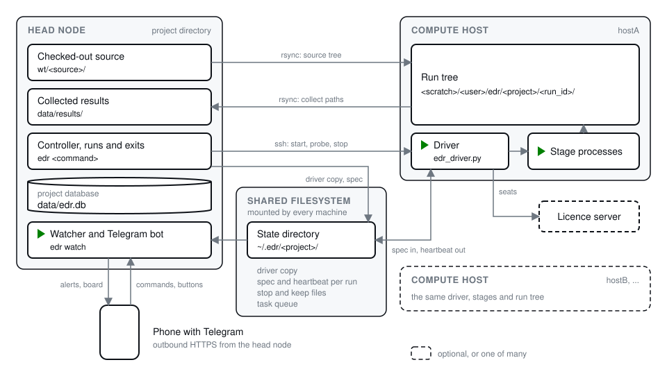
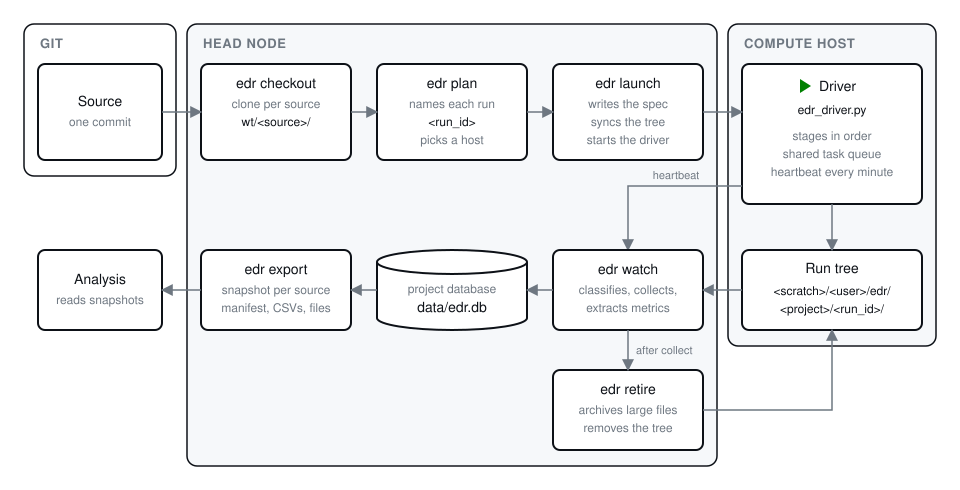

# How it works

This page follows one run from a commit of your flow to the numbers in the
database. After it you know which machine does what, which files move
where, and what edarunner does on its own and what it leaves to you. Each
step names the module that implements it in parentheses, in case you want
to read the code.

## The machines

The **head node** is the machine you work on. It runs `edr`, the command
you type, and `edr serve`, the one long-running process per user, which
keeps one watcher process, `edr watch --served`, per project. The
project directory is where you run `edr`. It holds the project database,
a single SQLite file `data/edr.db` that records every run, as well as the
checked-out copies of your source and the results collected from the
hosts. The site file is on the head node too, in `~/.config/edarunner/`.
That directory is a clone of the site repository, which every project and
every user of the lab shares.

A **compute host** is a machine that runs the flow. The site file lists
the hosts under `[hosts]`, and the name `local` stands for the head node
itself. Nothing is installed on a host: `edr` reaches it over ssh, and
the host runs a one-file driver with its own `python3`. Each run works
in its own run tree, `<scratch>/<user>/edr/<project>/<run_id>/`, on the
scratch disk of the host. [guides/site.md](guides/site.md) lists what a
host needs. With a `[scheduler]` table in the site file, HTCondor, Slurm
or LSF picks the host instead, and the driver runs as the scheduler's
job.

The **shared filesystem** is a directory that the head node and every
host mount at the same path: the state directory, `~/.edr/<project>` by
default. It holds the copies of the driver, one spec per run that tells
the driver what to do, and the heartbeat file that the driver writes
back. The stop and keep files and the task queues lie there too. The
licence-seat leases lie in `~/.edr/leases/`, which the drivers of all
your projects share, so the hosts must mount `~/.edr` as well (`EDR_HOME`
moves it). The head node never needs a connection to a running driver;
it reads the files.

An alert leaves the head node over outbound HTTPS or SMTP, to Telegram,
ntfy or mail. None of them is required. The channels are yours, not the
lab's, so they live in `~/.config/edarunner/user.toml` next to the site
file.

## One run, from start to end

The example below launches the batch `sweep1`. A batch is one file
`jobs/sweep1.toml` that names a source version and a list of jobs, and
a run is one job started on one host.
[guides/project.md](guides/project.md) sets up the files, and
[guides/run.md](guides/run.md) gives the commands in the order you type
them.

### Checkout

`edr checkout <ref>` pins one commit of the flow's repository. It
fetches the repository when it has a remote, and makes a detached local
clone of the commit under `source.worktrees/<hash>`, where `<hash>` is
the short hash of the commit. Each repository that `source.nested` names
gets its own clone inside that tree. The short hash is the source tag of
every run built from this tree, and the batch file names it as
`source` (`checkout.py`).

Every run works on a copy of this clone, so a commit you make later
never changes a running flow. A tree with uncommitted changes can go in
as a snapshot with `edr checkout --dirty <dir>`: a clone of its HEAD with
your changes copied over it, tagged `<hash>-dirty-<8 hex>` from the
sha256 of its diff. The diff covers the untracked files that git does
not ignore and the changes in each nested repository, and `checkout`
writes it into the clone and into `data/sources/<tag>/` (`runid.diff`,
`checkout._snapshot`). `launch`
refuses a dirty tag unless you pass `--allow-dirty`, and it records the
commit of each nested repository of the clone in the spec of every run.

Apart from that `git fetch`, edarunner leaves your source repository
alone, and the repository is never the target of a delete
(`cli._worktree_target`).

### Plan

`edr plan sweep1` works out what a launch would do and writes nothing
(`launch.plan`). It reads the batch, computes the build tag of each job
from its configuration name and overrides, and names each run
`<date>_<label>_<build_tag>_g<source>` by default. The first launch pins
the date in `<state_dir>/sweep1/RUN_DATE`, so runs of the batch that
start later, after the stagger or from the queue, keep the same date; a
plan before that first launch shows the current time. A job with
`host = "auto"` goes to a host with enough free cores, RAM and disk, with
its scratch above the floor of the host, with fewer than `max_per_host`
of your runs, and with every tool the job needs (`hosts.place`); when no
host fits, the job is queued. Your runs on a host are the live
heartbeats of every registered project, plus the launches that wrote no
heartbeat yet: a launch records each run it places in
`~/.edr/reservations/`, and it counts and records under
`~/.edr/place.lock`, so two launches at once never both take the last
place on a host (`census.running_per_host`). Every string of the job is
then rendered into a spec. A placeholder without a value stops the plan
with an error that names it.

When the batch's source is not checked out yet, `plan` and `launch`
check out a clean ref for you.

A plan is one of the read commands, which never create a file. Every
command that writes takes `--dry-run`, which prints every path and every
command with `(dry)` or `dry:` and writes nothing at all: no date pin,
no spec, no driver copy, no stop or keep file, no database row or event,
not even the database file, and nothing under `data/board/` or
`data/results/`. `tests/test_e2e_local.py::test_dry_run_flow_writes_nothing`
runs the whole flow dry and checks that the state directory does not
exist afterwards and that the source tree is unchanged byte for byte
(`cli.Ctx`, `cli._READ_COMMANDS`).

### Launch

`edr launch sweep1` does the same planning and then acts on it
(`launch.launch`). First it pins the date and publishes the driver to
`<state_dir>/bin/edr_driver-<hash>.py`, where `<hash>` comes from the
text of the driver. The copy is written to a temporary file and renamed,
and an existing copy is reused. A new driver version therefore gets a
new file, and a driver that is running never sees its own file change
(`sync.publish_driver`).

For each run, `launch` first looks for the run's spec. When the spec
exists, the job counts as launched and is skipped, so a batch is never
launched twice; a new sweep needs a new batch name.

Then it copies the checked-out tree to the run tree on the host with
`rsync -a --delete`, `.git` included, so the host gets a normal git
checkout of the pinned commit and the flow can ask git for its version
there. The paths in `[sync] exclude`, such as a virtual environment,
stay behind (`sync.sync_tree`).

Before that rsync, and before every other `rm -rf` or `rsync --delete`,
the target passes a guard (`guards.assert_safe_target`). The guard
refuses:

- an empty or relative path, `/`, and your home directory;
- a path with one component, such as `/scratch`;
- a path without the safety marker, `/edr/` by default (`safety.marker`),
  and an empty marker;
- a path with fewer components than `safety.min_depth`, 4 by default.

A `..` segment is resolved first, so it cannot carry the marker past the
tree it names. A path built from a run id also passes
`guards.assert_run_id`, which refuses an id that does not start with
`YYYYMMDD_HHMM_`. A refusal prints `edr: <reason>`, exits 1, runs
nothing after it, and writes no event, because nothing happened.

Next, `launch` writes the spec through a temporary file and a rename,
records the run and a `launch` event in the database, and starts the
driver. On an ssh host it runs `setsid nohup python3 <driver> <spec>`,
so the driver starts in its own session and never shares one with your
shell (`backend.SshBackend.submit`). Under a scheduler, `launch` submits
a job instead (`schedulers.py`). Runs start `stagger_s` seconds apart. A job
that no host fits is recorded as `queued` for the watcher to start
later.

### Setup on the host

The driver loads the spec, writes its first heartbeat with the phase
`setup`, and checks the free space at the run tree against
`needs.disk_gb` of the first stage; too little ends the run with exit 3.
Then it runs `[runtime] setup`, when the project has one, in the root of
the run tree with the environment of the stages. This is the step that
builds the flow's environment on the host, such as `uv sync --frozen`.
Its output goes to `log/setup.log`, and a failure ends the run as
`FAILED:runtime` before any stage waits for a licence seat
(`Driver.setup_runtime`).
[guides/project.md](guides/project.md#the-runtime-step) shows how to
write it.

### Stages and steps

The driver then runs the stages in the order of `edr.toml`. A stage is
one command of the flow. The driver starts it as `/bin/bash -c "<cmd>"`
in a new session, with standard input from `/dev/null` and the output
appended to `log/<stage>.log` in the run tree (`Driver.spawn`). Since
every stage has its own session and process group, a signal to a tool's
group never reaches your shell. While the command runs, the driver runs
the stage's `progress` command every 5 seconds and takes the first
number it prints as the step that runs now, so the board can say
`pnr 4/13` inside a single tool session. The first time it sees a step
number is the start time of that step in `step_runs`.

A stage whose `needs.tools` names a tool with a probe waits at a gate
first, with the phase `gate:<stage>`. The driver runs the probe, takes
the first number as the free seats, and subtracts the seats that other
drivers leased in the last `lease_s` seconds. When enough seats are
left, it writes one lease file per seat under `~/.edr/leases/<tool>/`
by a rename, and counts again; when an older lease of another run now
leaves too few seats, it backs off. The directory is the same for every
project of the user, and a lease file starts with the project and the
run id, so the drivers of two projects never take the same last seat. Of two drivers that read the same
free seat, the later one therefore waits (`Driver.take`). The driver
polls every 5 seconds up to `gate_max_s` and then fails the stage with
exit 4. It removes its leases when the stage ends, on every exit path
(`Driver.release`). A probe that fails counts as unknown, and the stage
runs.

A stage with `foreach = "tasks"` is a task group: its command runs once
per task, `parallel` at a time, each in its own directory with its own
log and budget. The tasks come from a queue of files in the state
directory, and a task is claimed by a rename, so two drivers that share
a queue share one pool. The group counts every failed task, and a run
with a failed or skipped task ends
`INCOMPLETE:<n>f<m>s` with exit 8, never `done`. After `limits.streak`
failures in a row with the same signature, the last log line with its
digits removed, the group sets `looping` and claims nothing more
(`Driver.end_task`, `Driver.main`).

The driver also enforces the limits of the project. None of them
deletes a file:

| Limit | Checked by | What happens |
|---|---|---|
| `needs.disk_gb` of the first stage | the driver at start | below it the run fails with exit 3 |
| `needs.disk_gb` of a task | the driver before each claim | below it the task is `skipped` and counted |
| `budget.hours`, `budget.disk_gb` | the driver while a command runs | the phase becomes `OVER_BUDGET:<stage>`; with `kill = true` the process group gets `SIGTERM`, else the command runs to its end; the run then stops with exit 9, and `edr continue` runs the stages left |
| `budget` with `per = "task"` | the driver per task | only that task gets `SIGTERM` |
| `retry` | the driver after a failure | when `retry.match` is in the last 80 lines of the log, the stage runs again after `retry.wait_s`, up to `retry.max` times, as `retry:<stage>:<n>` |
| `host_free_min_gb` of the site, or of the host | the driver between stages and before each claim | nothing new starts and `host_full` is set; after `grace_s` the watcher that holds `serve.lock` stops the newest run on that host, of any of your projects |
| `limits.streak` | the driver per task group | `looping` is set and the group claims nothing more |
| `limits.hung_s` | the watcher | a run without progress for that long is `hung` |

When every stage has run, the run ends `done` with exit 0. The phases
and their exit codes are listed in
[guides/run.md](guides/run.md#phases).

### The heartbeat

Every `heartbeat_s` seconds, 60 by default, and at every change of
phase, the driver writes `<state_dir>/<batch>/<run_id>.json`. The file
holds the phase, the stage and step, the driver's pid and the process
groups it started, the CPU time and memory of those groups, the free
disk, and a record per stage and task. Like the spec, it goes to disk
through a temporary file and a rename, so a reader never sees half a
file (`Driver.beat`, `config.save_json`). At every heartbeat the driver
also reads the keep file, and every half second while a command runs it
reads the stop file.

The heartbeat is the only channel from the driver to the head node. A
heartbeat file keeps its last phase after the driver dies, so a fresh
phase on the board does not prove that the driver is alive. The watcher
calls a run `stale` once the heartbeat is older than `stale_s`, and
`dead` once it is older than `dead_s` and the driver process is gone
from the host. `edr status --live` asks the hosts directly
(`watch.classify`, `cli._mark_live`).

### The watcher's cycle

`edr watch` runs a cycle every `heartbeat_s` seconds (`watch.cycle`).
One watcher runs per project: it holds `<state_dir>/watch.lock`, and a
second one exits 2 and names the pid of the first. `edr projects`,
`edr serve --dry-run` and the supervisor take the holder of that lock as
the watcher of the project. The lock gives the same answer on every host
that shares the state directory, which a pid does not. The watcher reloads
the project files at the start of each cycle, so an edit takes effect
without a restart. A file that does not load gets one alert per error
text, and the watcher goes on with the last config that loaded: it
still reads the heartbeats, alerts and collects, but it resumes and
launches nothing until the file loads again (`watch.run_forever`). edr
never deletes a file of yours on its own: the only files a watcher
removes are expired seat leases and reservations in `~/.edr/`. One cycle
does this, in order:

1. It reads the heartbeat of every run in every batch without a
   `RETIRED` file, and writes the runs, their stages and steps and a
   resource sample into the database (`watch.ingest`). A retired batch
   is left alone from then on.
2. It asks the backend once whether each live driver exists, then gives
   each run a state: `running`, `stale`, `dead`, `hung`, `host_full` and
   the rest of [reference/states.md](reference/states.md). A change of
   state writes an event.
3. A state that alerts sends one message per run and state to every
   channel in the site file. A new reason for the same state edits the
   Telegram message in place. After `grace_s`, the watcher takes the
   action of the state: it stops a `superseded` run after its task, and
   sends `SIGTERM` to a `hung` run only with `kill_hung`. A keep file
   holds off both for its hours (`watch._act`, `config.kept`).
4. For every stage and task that ended, it copies `log/` and the stage's
   `collect` paths from the run tree into `data/results/<run_id>/` on
   the head node. Of a running stage with steps, it copies each numbered
   directory under the `collect` paths below the step that runs now, as
   soon as the step number moves on (`collect.py`).
5. It reads each metric from the collected files of the tasks that
   ended `done` and the stages that exited 0. From any other stage, it
   reads the steps that the run has passed: `step_runs` holds the step
   and a later one. It writes the rows to the database with the file each
   number came from, and one `metrics` event per run that counts the new
   rows and names them. It also records the run's configuration, build
   tag, source tag and overrides once (`watch.extract_run`,
   `metrics.py`).
6. A `dead` run is resumed once, from the last step in its heartbeat,
   when its stage has a `resume` command and no process group of the run
   is still alive on the host (`watch._resume`).
7. A queued job starts when a host now fits it, one per batch per cycle.
8. It writes `data/board/`, edits the pinned Telegram board, and writes
   `<state_dir>/watch.json`, the watcher's own heartbeat that the
   supervisor and `edr watch --check` read. The host probes of the
   boards come from the census when it is younger than two cycles, and
   from a probe of its own otherwise.

The watcher never downloads anything, never resumes a run twice and
never reads a retired batch. The read commands such as `edr status`
ingest the heartbeats too, so the board follows the driver even between
two cycles.

### The work of the user

Some work belongs to the user and not to one project: a host, a tool
process and a seat lease are one each, whatever project they serve. The
supervisor `edr serve` holds `~/.edr/serve.lock` and does this work once
a minute for every registered project (`census.work`). Without a
supervisor, the first watcher that takes the lock keeps it for its life
and does the work after each of its cycles:

1. It takes the census: one ssh call per host of the site of every
   registered project, all at once, for the probe, the clock of the host
   and the list of your processes, plus the live heartbeats of every
   project. It writes the probes and the live runs to
   `~/.edr/census.json`, where the other watchers and `edr brief` read
   them.
2. It sends one alert per tool process of yours that matches
   `tool_procs` and that no live run owns. The process list carries
   `EDR_RUN_ID`, which the driver sets for every stage command. A live
   run of a registered project owns its processes; a run that ended, or
   whose driver is gone from the host after `dead_s`, leaves them
   orphans, and the alert names the run as `project/label@batch`. A run
   id that no registered project knows is left alone, unless the working
   directory or the command line of the process lies in the tree
   `/<project>/<run_id>` of a registered project under its safety
   marker. A process without `EDR_RUN_ID` is owned when its working
   directory or command line holds the safety marker of a registered
   project. With `kill_orphan` of the project the process belongs to, it
   sends `SIGTERM` after `grace_s`; a process of no project is never
   killed.
3. While a live run on a host reports `host_full`, it stops the newest
   run on that host with `--now` once per `grace_s`, whatever project
   the run belongs to. A keep does not hold this stop off, since a full
   disk blocks every other user of the host.
4. It removes a seat lease whose run has no heartbeat in a registered
   project, has ended, is dead or has left the stage, or that is older
   than the stage budget, and writes a `lease` event with the reason
   into the database of the lease's project (`census.sweep_leases`).
5. It sends one alert per host whose clock is more than 60 s off the
   head node's, and drops the reservations of runs that wrote their first
   heartbeat or are older than 30 minutes.
6. Once a day, from `digest_at` of the user file on, it sends one digest
   of every registered project (`notify/digest.py`).

A watcher that does not hold the lock runs its own cycle only and tries
again at the next cycle, so the role moves on when its holder stops. A
watcher that the supervisor started never tries.

### The supervisor

`edr serve` runs a cycle every minute (`serve.Supervisor`). It loads
every registered project, and keeps one `edr watch --served` per project
in the project directory. A served watcher takes its host probes from
the census, leaves the work of the user and the pinned board to the
supervisor, and writes `watch.json` also before each collect and each
launch, so a long copy counts as progress.

- A watcher that exits starts again after 1, 2, 4, 8, 16 and at most 30
  minutes; the first exit of a series sends an alert.
- A watcher whose `watch.json` stood still for three heartbeats and at
  least 15 minutes while its config loads is killed, started again, and
  alerted.
- A project whose files do not load and that has no watcher gets one
  alert per error text and no watcher until the files load. A watcher
  that runs goes on with its last good config, as above.

After the watchers it does the work of the user, edits one pinned board
with the live runs of every project and the hosts that hold them, and
writes `~/.edr/serve.json`, its own heartbeat that `edr serve --check`
reads. Under systemd it sends `READY=1` once it holds the lock and
`WATCHDOG=1` every cycle, so a supervisor that hangs is restarted. A
watcher that hangs is the supervisor's job.
[guides/projects.md](guides/projects.md) shows the supervisor from the
side of the user.

The Telegram bot is a thread of the supervisor, or of the watcher that
holds `serve.lock` when no supervisor runs; every other watcher only
sends its alerts. The bot takes the commands and button presses of
every registered project and finds the project of each one
(`cli.Router`). It obeys one chat and, when set, one user, and it never
runs a shell string or free text: a custom command is an argv list from
the site file, and every argument from the phone must match its
allowlist regex in full. The bot never kills a process and never runs
`launch` or `rm`. Its one delete is the Free space button of a
`host_full` alert, which runs `edr retire --host <host> --prune <names>`
after a second tap. It starts new work only through the Continue button
of a run that ended with stages left, which runs `edr continue <handle>`
after a second tap (`notify/telegram/bot.py`,
`notify/telegram/buttons.py`, `notify/telegram/custom.py`).
[guides/alerts.md](guides/alerts.md) sets it up.

### Stop and keep

A stop never selects processes by a session name or a pattern. It
signals the `driver_pid` and the process groups that the heartbeat
recorded, and it refuses a pid or a group id of 1 or lower, since 0
would signal your own process group and -1 every process you own
(`launch.stop`, `backend.check_pid`, `hosts.Ssh.kill_pgid`). A stop takes
one handle, so one mistake costs at most one run.

There are three strengths. `edr stop <handle> --after-task` writes the
stop file next to the spec; the driver lets a one-command stage run to
its end and a task group finish its running tasks, records the tasks
the group did not start as `held`, and then ends the run `STOPPED`. A
plain `edr stop` sends `SIGTERM` to the driver and its groups and waits
up to 60 seconds. The driver forwards the signal to its groups, waits
10 seconds, sends `SIGKILL` to what is left, writes a final heartbeat
and exits 10 (`Driver.on_signal`). When the driver is still alive after
the wait, `edr stop` exits 3, and `--now` is the next step: `SIGTERM`,
then `SIGKILL` after 30 seconds. A queued run that is stopped is marked
`stopped` and never starts.

A run that ended `STOPPED` after a one-command stage, or `OVER_BUDGET`
after a stage that ran to its end, did not run the stages after that
stage. The watcher sends one alert for it, and `edr continue <handle>`
runs those stages as one new run on the same tree, from the stage after
the last one that ended with exit 0 (`launch.stages_left`). A task group
that a stop or its budget cut short ends with exit 0, but it holds the
tasks it did not start, so it counts as left, and `continue` runs only
those tasks in it. `continue` refuses while a run on the tree has not
ended. It also refuses when that next stage started but did not end
with exit 0, since the stage would start over and could delete the
checkpoints its resume needs.
[guides/run.md](guides/run.md#more-work-on-an-existing-tree) shows the
commands.

`edr keep <handle> --hours <n>` writes the keep file. The driver adds the
hours to the budget of the running stage or task, and for as many hours
the watcher neither kills the run as `hung` nor stops it as
`superseded`. The stop of a full host does not wait for a keep. Both
`stop` and `retire` require `--why`, and the text goes into the event
log with the name of whoever acted.

### Retire

A run tree stays on its host until you retire it. `edr retire <handle>
--why <text>` removes the tree with `rm -rf` after the guard above
(`cli.cmd_retire`, `cli._retire_targets`). It refuses a run whose driver
is alive, a live run that has not written a heartbeat yet, and a tree
whose results are not collected unless you pass `--uncollected`. It
also refuses a root that another live run uses, and a root shared with
a run whose results are not collected yet (`cli._refuse_shared_root`).

`--batch` retires every run of a batch and writes the `RETIRED` file,
which keeps the watcher and the board away from the batch. It then
removes the batch's checked-out source unless a batch that is not
retired uses the same source; that tree passes the guard too. The diff
of a dirty source stays in `data/sources/<tag>/`. `--host`
with `--prune` removes the prune targets of every finished run of the
project on one host, to free a full scratch disk. It skips a run whose
tree has stages left, since those stages may need the files.
[guides/cleanup.md](guides/cleanup.md) covers retire, prune and the
archive of large files.

### Where the results end up

The files you asked for end up on the head node.
`data/results/<run_id>/` holds the collected files in the layout of the
run tree, and `data/edr.db` holds every run, stage, step, metric, file
and event. The metric rows name their source file, so each number can
be traced to the report it came from. The `parameters` table holds the
vars, the overrides and the nested commits of each run as its spec
recorded them, and the values that its `[parameters.<name>]` tables read
from the run's own files, each row with its origin, and
`data/sources/<tag>/` holds the diff of each dirty source
(`watch._parameters`, `metrics.extract_parameters`,
`checkout._snapshot`). The `flags` table holds what the checks found
wrong with a run's identity; each extraction rewrites the flags of the
run (`watch.check_run`). The `instances` table holds the per-instance rows
of an area report or a per-instance CSV, down to the depth the metric
keeps; `edr compare --instances` reads a deeper level from the collected
file itself (`metrics.parse_instances`, `analysis.instance_delta`). The
`task_fields` table holds the fields each task of a run ran with, from
the spec or from `edr import`, and an export writes them to
`task_fields.csv`.

Only the head node opens the database. SQLite's WAL journal does not
work on a network filesystem, so the database reads the type of the
filesystem under `data/` when it opens. On NFS, SMB, 9p and FUSE it uses
the DELETE journal with `synchronous=FULL`, and WAL elsewhere; `edr
check` warns when the database sits on such a filesystem (`db.Database`,
`cli.cmd_check`). A local `data/` is still the better place, because the
watcher and each `edr` call take a file lock there. A writer waits up to
30 s for the lock of another, and the watcher, `edr import` and `edr
extract` write the metric rows of a run in one transaction. `edr
metrics`, `compare`, `runtime`, `events` and `coverage` open the
database read-only and create no file next to it (`cli._READ_ONLY`).

`edr metrics --source` and `edr export` match each source tag exactly,
and read several tags only when each has its own `--source`, so two
versions of the design end up in one table only on purpose
(`cli.cmd_metrics`, `export._select`). `edr metrics --label` and
`--task` read every source on purpose, to find a number, and name the
source on each row. `edr export` writes a snapshot, a frozen directory
with a manifest, and an analysis reads that snapshot instead of the live
database. The export event names the directory, so `edr metrics` lists
the snapshots whose manifest holds each run (`analysis.snapshots`).
`edr compare` names the sources when the runs it compares come from more
than one.
[guides/results.md](guides/results.md) shows the commands.

A snapshot holds tables: the runs, metrics, parameters, task fields,
instances and flags of the exported runs, with the diff of each dirty
source. The collected files come only on request, `--files` for those
that the exported rows cite and `--with` for others, each under its run
id with the run, stage, step and task in the manifest (`export.export`).
